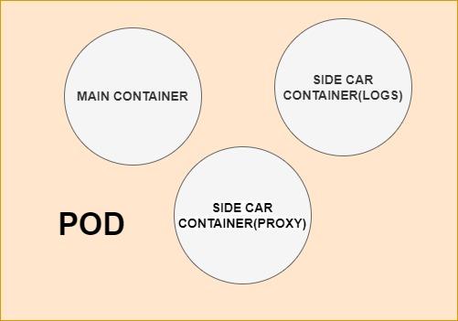
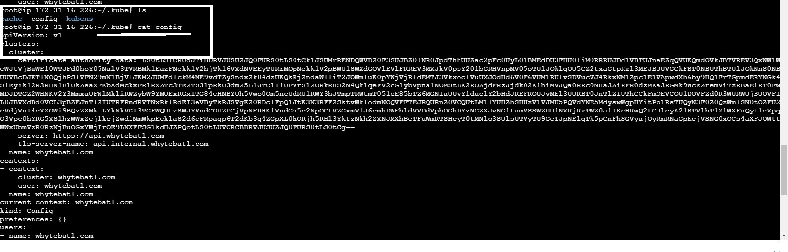

## MASTER NODE <br>
1. **Api Server** <br>
Its handles requests (kubectl, other services), and validates configurations.<br>
2. **Control Manager** <br>
Runs control loop processes like:<br>
Node Controller:            Manages node status.<br>
Replication Controller:     Ensures desired number of pod replicas.<br>
Endpoint Controller:        Populates endpoint objects.<br>
Service Account Controller: Manages default accounts.<br>
3. **ECTD** <br>
Database for the cluster, stores all the infomation of the cluster<br>
4. **Kube-Scheduler** <br>
Assigns workloads (Pods) to available nodes.<br>


## WORKER NODE
1. **kubelet**<br>
   manages the Pods and regularly checks whether the pod is running or not defined as per in PodSpecs.<br>
   If Pod is not responding the kubelet will ensure that pod will be replaced or restarted.<br>
   Communicates with the Kubernetes control plane to manage the state of the pods.<br>
2. **kubeproxy**<br>
   Communication inside the cluster. Assigns IPs to the pods. Manages kubernetes Services (ClusterIP, NodePort, LoadBalancer)for Pods.<br>
3. **container runtime** <br>
   The softwate which responsible  for running container<br>
4. **Pods:**  <br>
Acts as Shell for the container or multiple containers where the application is deployed.  It’s good to have one container under each pod. <br>

   **ALL THE COMPONENTS ARE WORKING AS PODS BY ITSELF. BUT KUBELET IS DEPLOYED AS DEMON SERVICE**


## Features of Kubernetes<br>
1. __AutoScaling__<br>
 Kubernetes supports two types of autoscaling horizontal and vertical
scaling for large-scale production environments which helps to reduce the downtime of
the applications.<br>
2. __Auto Healing__ <br>
containers will automatically repaired or heal and run again properly.<br>
3. __Load Balancing__ <br>
With the help of load balancing, Kubernetes distributes the traffic between two or more containers.<br>
4. __Platform Independent__ <br>
Kubernetes can work on any type of infrastructure whether it’s On-premises, Virtual Machines, or any Cloud.<br>
5. __Fault Tolerance__ <br>
Kubernetes helps to notify nodes or pods failures and create new pods or containers as soon as possible<br>
6. __Rollback__ <br>
You can switch to the previous version.<br>
7. __Health Monitoring of Containers__ <br>
Regularly check the health of the monitor and if any container fails, create a new container.<br>
8. __Orchestration__  <br>
Suppose, three containers are running on different networks<br>
(On-premises, Virtual Machines, and On the Cloud). Kubernetes can create one cluster<br>


## POD EXPLAINATION<br>
1. **Main Container:**     This runs the primary application (myapp:latest).<br>
2. **Sidecar Container:**  Provides auxiliary functions (e.g., data sync, logging).<br>
3. **Shared Data Volume:** Both containers share the shared-data volume, enabling them to exchange data via the file system.<br>

### Kubernetes configuration file (.kube/config)
- This file stores the configuration details, such as clusters, users, and contexts, which are essential for kubectl to interact with the Kubernetes cluster.
- The file is typically located in the user's home directory (~/.kube/config) and is used by kubectl to authenticate and connect to the cluster.
```sh
 cat ~/.kube/config
 ```
 

