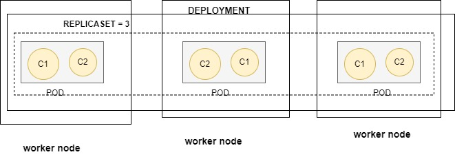
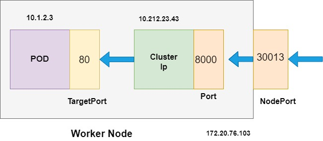

#  Overview on Pods, Deployments, Namespaces, Services, and Commands

## Overview

This repository provides an introduction to key Kubernetes concepts including Pods, Deployments, Namespaces, and Services. The examples and commands provided here will help you understand how to manage and deploy applications in a Kubernetes cluster using both imperative and declarative approaches.

## Contents

- [Pods](#pods)
- [Deployments](#deployments)
- [Namespaces](#namespaces)
- [Services](#services)
- [Commands](#commands)

## Pods
Pod is wrapper/shell on the container. Each pod contains one or more containers.

### Commands

- View available resources: `kubectl api-resources`
- Explain pod details: `kubectl explain pod`
- Explain pod specifications: `kubectl explain pod.spec.affinity`
- List pods: `kubectl get pods`
- List pods in a specific namespace: `kubectl get pods -n alpha`

## Deployments

Deployments manage the creation and scaling of ReplicaSets, ensuring your applications have the desired number of running instances.

### Types of Deployments

- **Imperative Format**: Using kubectl commands.
  ```sh
  kubectl run nginx -n dev --image=nginx --dry-run=client -o yaml
  ```

- **Declarative Format**: Using YAML files.

## Namespaces

Namespaces are used to divide cluster resources between multiple users. They are useful for scenarios where multiple teams (e.g., dev or qa teams) share the same cluster but require resource isolation.

### Commands

- Create a namespace:
  ```sh
  kubectl create ns dev
  kubectl create ns qa
  ```
- List API resources that are namespaced:
  ```sh
  kubectl api-resources
  kubectl api-resources --namespaced=true
  ```

## Services

Services provide stable IP addresses and DNS names to Pods. They allow you to expose your applications within or outside the cluster.

### Commands

Here's a quick reference for common commands used in this tutorial:

- Create namespaces:
  ```sh
  kubectl create ns dev
  kubectl create ns qa
  ```
- Default command to switch without kubens 
```sh
kubectl config set-context $(kubectl config current-context) --namespace=dev

```
- switch between the namspaces(kubens)
```sh
sudo su
cd /usr/local/bin
wget https://github.com/ahmetb/kubectx/releases/download/v0.9.5/kubens_v0.9.5_linux_x86_64.tar.gz
tar zxvf kubens_v0.9.5_linux_x86_64.tar.gz
rm -rf kubens_v0.9.5_linux_x86_64.tar.gz
```

- Switch  between clusters
```sh
sudo su
cd /usr/local/bin
wget https://github.com/ahmetb/kubectx/releases/download/v0.9.5/kubectx_v0.9.5_linux_x86_64.tar.gz
tar zxvf kubectx_v0.9.5_linux_x86_64.tar.gz
rm -rf kubectx_v0.9.5_linux_x86_64.tar.gz 
```

- Create a deployment:
  ```sh
  kubectl run nginx -n dev --image=nginx--dry-run=client -o yaml
  ```
- View available resources:
  ```sh
  kubectl api-resources
  ```
- Explain resources:
  ```sh
  kubectl explain pod
  kubectl explain pod.spec.affinity
  ```
- List pods:
  ```sh
  $ kubectl get pods
  NAME                                         READY     STATUS      RESTARTS    AGE
  ingress-nginx-controller-7d67b4775b-vpz6b    1/1       Running      0          2m13s
  READY 0/1: This means that the pod has one container, but it is not yet running or ready.
  READY 1/1: This means that the pod has two containers, and both containers are running and ready.
  $ kubectl get pods -n dev
  ```
- Login into the pod
```sh
kubectl exec -it <pod-name> -- /bin/bash

```
- Expose a pod:
```sh
kubectl get svc
kubectl expose pod nginx1 --type=NodePort --port=80 --target-port=80 --name=nginx-service
kubectl delete svc nginx2
open NODEPORT(GIVEN IN THE SVC) ON THE AWS SG
DNS:Nodeport
kubectl describe svc nginx
  ```

- Rancher installation 
```sh
docker run -d --restart=unless-stopped  -p 80:80 -p 443:443  --privileged  rancher/rancher:latest
docker logs  58219c96294d   2>&1 | grep "Bootstrap Password:"
Admin@280324
curl --insecure -sfL https://54.82.26.66/v3/import/6tfkvcrr4zfp2kt8nrc6x4gckj7p7qlkn5bjl4v4ncdxk68v8lp6pg_c-m-9frqpphw.yaml | kubectl apply -f -
```
- Labels: <br>
Labels are key-value pairs attached to objects, such as pods, that are used to identify, organize, and select them based on these labels. For example, if you have multiple pods running Nginx, you can assign this label to all of them, making it easier to find and manage them together.
```bash
metadata: 
 name: my-pod 
 labels: 
   app: my-app 
   tier: frontend
```
- commands for labels
```sh 
 kubectl get pods --show-labels
```
 If want to attach custom name for the pod which does have a label
```sh
  kubectl label pod <pod_name> label:<label_name>
```

### DETAILS OF NODEPORT 
```sh
kubectl expose pod nginx1 --type=NodePort --port=8000 --target-port=80 --name=nginx-service
kubectl get svc nginx-service
 NAME             TYPE       CLUSTER-IP      EXTERNAL-IP   PORT(S)          AGE
 nginx-service    NodePort   10.104.104.20   <none>        8000:30013/TCP   1m
```
- --port=8000: The service exposes port 8000 to clients. <br>
- --target-port=80: The service forwards traffic from port 8000 to port 80 inside the NGINX pod.<br>
-  Kubernetes will assign one from the default range (30000–32767).