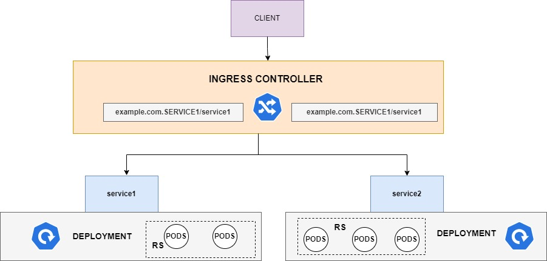

## INGRESS CONTROLLER
### WHY INGRESS CONTROLLER? <br>
If you need to expose the service of type loadbalancer, you need one NLB for each service . <br>
 This becomes repeated task to configure and not cost effective. Ingress controller is a solution to this problem. <br>

### Key Features:
- **Routing:** Directs external HTTP/S traffic to specific services based on URL paths or hostnames.<br>
- **TLS/SSL:** Handles SSL termination for secure communication.<br>
- **Load Balancing:** Distributes incoming traffic among multiple backend pods.<br>
- **Rewrite Rules:** Supports modifying URLs or headers for backend services.<br>
- **Authentication:** Integrates with external authentication systems.<br>

### Popular Ingress Controllers:
- **NGINX Ingress Controller:**  Most widely used, supports advanced features and is production-ready.<br>
- **Traefik:** Lightweight and provides dynamic configuration.<br>
- **HAProxy Ingress:** High performance and reliability for enterprise use cases.<br>
- **Istio Gateway:**  Part of the Istio service mesh.<br>
- **AWS ALB Ingress Controller:** Integrates with AWS Application Load Balancer.<br>
- **GKE Ingress:**  Native for Google Kubernetes Engine.<br>

### How It Works:
- You deploy an Ingress Controller in the cluster (as a pod or daemon).<br>
- You define an Ingress resource with rules and routes.<br>
- The controller monitors these resources and configures the underlying system (like NGINX or Traefik) to manage traffic.<br>

### A Record
- **Purpose:** Maps a domain name to an IP address (IPv4). 
- **Usage:** Directs traffic to a specific IP address. Essential for the basic functioning of websites and services.

### TXT Record
-**Purpose:** Stores text data for various purposes.
-**Usage:** Commonly used for domain verification, email security protocols like SPF, DKIM, and DMARC.

### CNAME Record
- **Purpose:** Aliases one domain to another.
- **Usage:** Useful for pointing multiple subdomains to a single domain without having to manage multiple A records.

## Kubernetes Ingress Controllers Setup

This guide will help you set up Ingress Controllers, generate SSL keys, deploy Ingress Controllers, and manage Docker images in a Kubernetes cluster. We'll also create secrets and configure Route 53 records.

## Ingress Controllers

### Steps to Follow:

1. **Generate SSL Keys**
    - Navigate to the `/tmp` directory:
      ```sh
      cd /tmp
      ```
    - Create the key files `tls.key` and `tls.crt`:
      ```sh
      echo "<Your-Private-Key>" > tls.key
      echo "<Your-Certificate>" > tls.crt
      ```

2. **Deploy Ingress Controllers**
    - Create a secret for the SSL keys:
      ```sh
      kubectl create secret tls nginx-tls-default --key="tls.key" --cert="tls.crt"
      ```
    - Verify the secret:
      ```sh
      kubectl describe secret nginx-tls-default
      ```
    - List all secrets:
      ```sh
      kubectl get secrets
      ```

3. **Download Voting Images from Docker and Create a Private Container Registry on AWS**
    - Attach an IAM role to your instance with necessary permissions.
    - Tag and push the images to your private registry. After pushing, remove all local images:
      ```sh
      docker rmi $(docker images -aq) --force
      ```

4. **Deploy the Deployment**
    - Provide all the image details in the YAML manifest and deploy the deployment.
    - Expect an error due to missing secrets.

5. **Create Secrets**
    - Delete the deployment:
      ```sh
      kubectl delete deployment <your-deployment-name>
      ```
    - Create the necessary secrets:
      ```sh
      kubectl create secret docker-registry docker-pwd --docker-username=<your-username> --docker-password=<your-password> --docker-email=<your-email>
      ```

6. **Update YAML Manifest**
    - Add `imagePullSecrets` under the images section in your YAML manifest:
      ```yaml
      imagePullSecrets:
        - name: docker-pwd
      ```

7. **Configure Route 53**
    - Go to Route 53 and create the following records:
      - `www`
      - `vote`
      - `result`

8. **Deploy Ingress**
    - Deploy Ingress for the `result` and `vote` separately.

## Commands Used:

```sh
# Navigate to /tmp directory
cd /tmp

# Create SSL key files
echo "<Your-Private-Key>" > tls.key
echo "<Your-Certificate>" > tls.crt

# Create secret for SSL keys
kubectl create secret tls nginx-tls-default --key="tls.key" --cert="tls.crt"

# Verify the secret
kubectl describe secret nginx-tls-default

# List all secrets
kubectl get secrets

# Tag and push Docker images, then remove local images
docker rmi $(docker images -aq) --force

# Delete the existing deployment
kubectl delete deployment <your-deployment-name>

# Create Docker registry secret
kubectl create secret docker-registry docker-pwd --docker-username=<your-username> --docker-password=<your-password> --docker-email=<your-email>
```


---

This guide provides a simple walkthrough of setting up Ingress Controllers, generating SSL keys, deploying Ingress Controllers, creating secrets, and configuring Route 53 records. Follow the steps and use the commands provided to successfully set up your Kubernetes environment.
