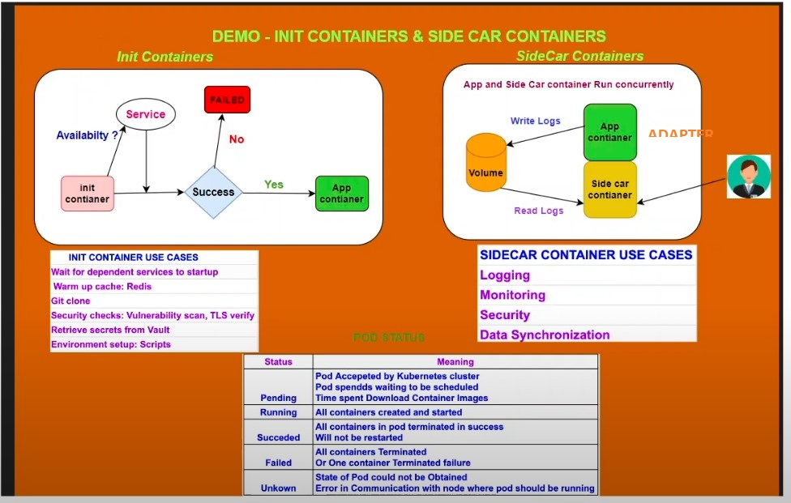

---

# Kubernetes Sidecar Containers and Resource Quotas

## Overview

This repository provides a practical demonstration of Kubernetes Sidecar containers and Resource Quotas, as covered in our YouTube video. It includes example configurations and scripts to help you understand and implement these concepts effectively.

## Contents

- **Adapter Containers(SIDE CAR CONTAINER)**: Containers that run alongside the main container for purposes such as logging, metrics collection, and proxy services. Demonstration using Istio Envoy Proxy.<br>
**Example:** Setting up configuration, checking for dependencies.<br>

- **Init Containers(initializing)**: Containers that run before the Main/App container to check dependencies.After launching the main container, init container can be deleted.<br>
   **Example:** Logging, monitoring, proxying.


### Resource Quotas

1. **Resource Quotas Overview**: Explanation of how Resource Quotas manage resource usage within namespaces.<br>
2. **Resource Limits**:          Setting limits on CPU and memory usage for containers.<br>

   - **Resource Units**:  Mi(Mebibytes), m (millicores), Gi (Gibibyte)

```sh
1Gi = 1 Gibibytes of RAM
1Gi = 1000 MB
1Gi = 1024 MiB
```
```sh 
For example:
100m = 0.1 CPU core.
1000m = 1 full CPU core = 1 vCPU (virtual CPU)
A container needing only 25% of a 1core can be allocated 250m(0.25 vCPU).
```

```sh
256Mi = 256 Mebibytes of RAM.
1 Mi = 1.048 MB.
```


2. **Example**:
   - **Namespace Creation**: YAML files to create namespaces with Resource Quotas.
   - **Pod Creation**: Steps to deploy pods and observe resource restrictions.

## Getting Started

1. **Clone the Repository**:
   ```bash
   https://github.com/chaitan28/k8s_directory.git
   cd 7DAY-Sidecar&Resouce-quote
   ```

2. **Apply Kubernetes Configurations**:
   ```bash
   kubectl apply -f deployments/
   kubectl apply -f resource-quota/
   ```

3. **Check Logs and Resource Usage**:
   - View Init container logs
     ```bash
     kubectl logs <init-container-pod> -c <init-container-name> -f
     ```
   - Monitor resource usage and quotas
     ```bash
     kubectl describe namespace <namespace-name>
     ```
4. **resourcequota commands**
 ```sh
 kubectl apply -f resource-quota.yml
 kubectl get resourcequota
 kubectl describe resourcequota <resourcequota-name>
 kubectl delete resourcequota <resourcequota-name>
 kubectl describe ns <development>
 kubectl delete ns <development
 ```

## Resources

- [Kubernetes Documentation on Sidecar Containers](https://kubernetes.io/docs/concepts/workloads/pods/#sidecar-containers)
- [Kubernetes Documentation on Resource Quotas](https://kubernetes.io/docs/concepts/policy/resource-quotas/)

 