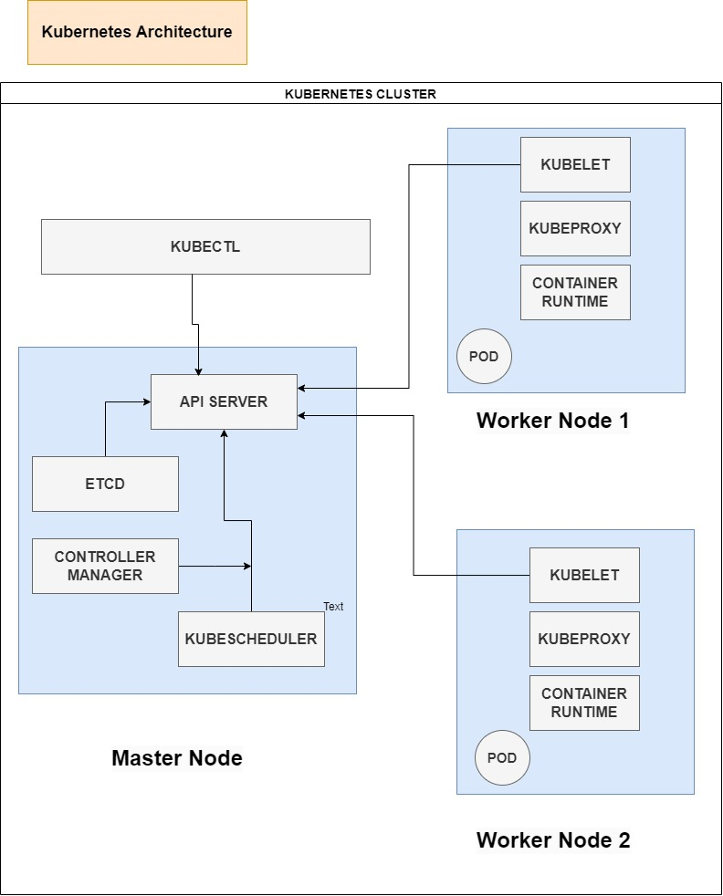

### MASTER NODE  
1. Api Server  
 :  handles requests (kubectl, other services), and validates configurations. 
2. Control Manager:  
Runs control loop processes like: 
Node Controller:            Manages node status. 
Replication Controller:     Ensures desired number of pod replicas. 
Endpoint Controller:        Populates endpoint objects. 
Service Account Controller: Manages default accounts. 
3. ECTD : database for the cluster, stores all the infomation of the cluster 
4. Kube-Scheduler:  
   Assigns workloads (Pods) to available nodes. 

### WOEKER NODE
1. kubelet: 
  It is responsible containers are running as defined in PodSpecs. 
2. kubeproxy: 
    communication inside the cluster. Assigns Ip to the pods  
3. container runtime  
   the softwate which responsible  for running container 

   ### ALL THE COMPONENTS ARE WORKING AS PODS BY ITSELF. BUT KUBELET IS DEPLOYED AS DEMONSETS