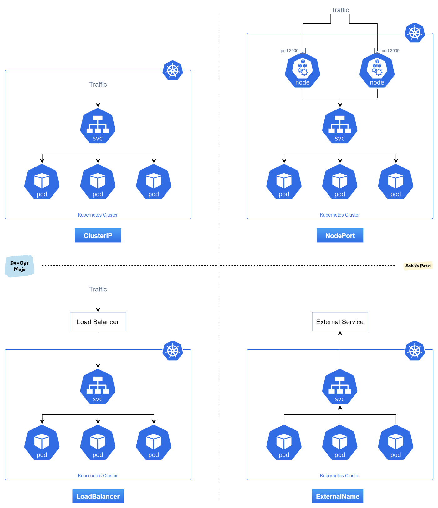

### Kubernetes Services

#### Explanation

**ClusterIP**: A service that is accessible only within the Kubernetes cluster.  For example: If I wanted to access the service inside the cluster(from master or any worker node) than both are accessible. communication between the front-end(Login signup Module) and back-end (DB)components of your app <br>

**NodePort**: NodePort service is an extension of ClusterIP service. NodePort service will route the traffic to cluster ip services by default. Exposes the service on each Node’s IP at a static port (the NodePort). Node port must be in the range of 30000–32767. This is primarily used for development purposes.   <br>

**LoadBalancer**: LoadBalancer service is an extension of NodePort service. Exposes the service externally using a cloud provider’s load balancer. <br>

**ExternalName**: Maps a service to a DNS name, simplifying the configuration and updates of external resources
Example: Product manager asks to integrate gDB which consists of generic data which are accessed by many apps. Data consists of reviews, customer feedback, etc in ECommerce website. Maps a service to a predefined externalName field by returning a value for the CNAME record.<br>

**Headless Service**: Used primarily for stateful applications (like databases) where you need direct access to individual pods. <br>

---

#### Commands

**ClusterIP**

1. Deploy a deployment and attach a ClusterIP service to it. Also, deploy the troubleshooting image.
   ```sh
   kubectl create deployment app1 --image kiran2361993/kubegame:v1 --replicas 3
   kubectl expose deployment app1 --port 80 --target-port 80 --type ClusterIP
   ```

2. Login to the troubleshoot pod and run the following commands:
   ```sh
   nslookup app1
   curl http://app1
   while true; do curl -sL http://app1 | grep -i 'IP A'; sleep 1; done
   ```

3. Describe the service:
   ```sh
   kubectl describe svc app1
   ```

4. Scale the deployment and describe the service again:
   ```sh
   kubectl scale deployment app1 --replicas=4
   kubectl describe svc app1
   ```

5. Get the service endpoints:
   ```sh
   kubectl get ep -o yaml
   ```
6.  Login into the pod
```sh
kubectl exec -it <pod-name> -- /bin/bash

```
**NodePort**

1. Expose the deployment with a NodePort service and check load balancing:
   ```sh
   kubectl expose deployment app1 --type=NodePort --port=80
   ```

2. Check load balancing:
   ```sh
   while true; do curl -sL http://<node-ip>:<node-port> | grep -i 'IP A'; sleep 1; done
   ```

3. Note: NodePort is not suitable for production as the NodePort cannot be given to the customer.

**LoadBalancer**

1. Expose the deployment using a LoadBalancer service:
   ```sh
   kubectl expose deployment app1 --name=app1-lb --type=LoadBalancer --port=80 --dry-run=client -o yaml
   ```

2. Add necessary annotations under the name field:
   - Refer to Kubernetes NLB annotations for specific cloud provider configurations.

**ExternalName**

- Use ExternalName to manage external resources effectively, reducing the risk of disruptions when external endpoints change.

**Headless Service**

- Primarily used for databases or StatefulSets where direct access to individual pods is needed. No IP is allocated to headless services.

---

#### Summary of Services

- **ClusterIP**: Accessible only within the cluster.
- **NodePort**: Exposes the service on a specific port on each node.
- **LoadBalancer**: Exposes the service externally using a cloud provider’s load balancer. Suitable for production.
- **ExternalName**: Maps a service to a DNS name for managing external resources.
- **Headless Service**: Used for stateful applications, providing direct access to individual pods.
